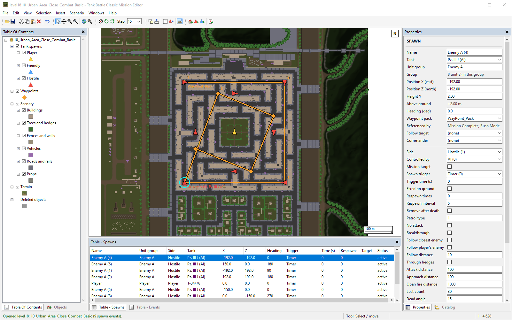
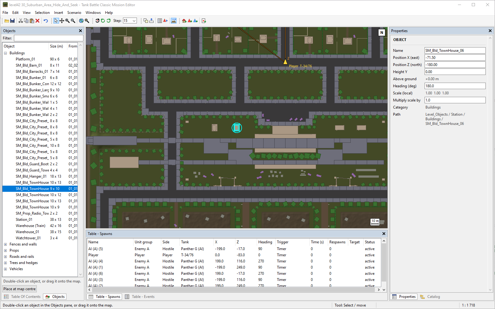

# Tank Battle Classic Mission Editor

Mission and map editor for the Windows game *Tank Battle Classic* (Steam). Edits your 
own installed copy. This unofficial application does not contain any game content and 
is not affiliated with the game's developer or publisher. Buy the game from 
https://store.steampowered.com/app/5086560/Tank_Battle_Classic/

## Start

Run `TankBattleMissionEditor.exe` (or `python editor.py` from source, see Build).
The editor finds the game in your Steam libraries or asks for its folder
(File > Select game folder). Double-click a mission in the Catalog.
**Close the game before saving**; restart it to see changes.

## What it does

- Move, rotate, add, copy and delete tanks, waypoints and scenery.
- Tank settings: type, side, AI behaviour, respawns, unit group, follow target
  (allied groups); one tank or many at once.
- Mission settings (nothing selected): fog, visibility, recon plane.
- Objects pane: place objects from any mission (double-click or drag).
- Insert waypoints (W at the cursor), routes and events (from this or another
  mission); choose an event's trigger and affected tanks in Properties.
- New scenarios from an existing mission (Scenario menu); they appear on a
  "Custom Missions" page in the game. The briefing screen is updated on save.

## Controls

| Input | Action |
| --- | --- |
| Click / Shift+click / Ctrl+click | select / add / toggle |
| Drag on empty map / drag selection | selection box / move |
| Right-click, middle or right drag, wheel | context menu, pan, zoom |
| Ctrl+X / C / V | cut / copy / paste (at the cursor) |
| Del, Ctrl+D, Q / E | delete, duplicate, rotate |
| Ctrl+Z, Ctrl+S, Ctrl+A, Esc | undo, save, select all, clear |

Help > Controls lists all shortcuts.

## Backups

The first save of a level keeps the original (File > Restore original).
Scenario > Remove custom scenarios undoes all scenarios. Backups and settings:
next to the sources, or `%LOCALAPPDATA%\TankBattleMissionEditor` for the executable.
Steam's "Verify integrity of game files" also restores everything.

## Limitations

- AI navigation data is not updated: AI tanks do not route around added or
  moved buildings.
- Only existing objects and tank types; terrain cannot be edited.

## Build

Requires Python 3.11+ on Windows.

    pip install -r requirements.txt
    python editor.py                      # run from source
    python -m unittest discover tests     # tests (need the installed game)
    python packaging/build_exe.py         # standalone executable + release zip

`.github/workflows/release.yml` builds and signs the executable on GitHub
(SignPath Foundation).

After a game update, refresh the script layouts and release a new version:

    pip install TypeTreeGeneratorAPI==0.0.10
    python packaging/generate_layouts.py  # writes layouts/tbc_layouts.json.gz

Until then the editor refuses to edit objects whose scripts changed.

## Licence

Copyright (C) 2026 fierman. GNU General Public License version 3, see
`LICENSE`. Bundled third-party components: see the release's
`THIRD-PARTY-NOTICES.txt`.
